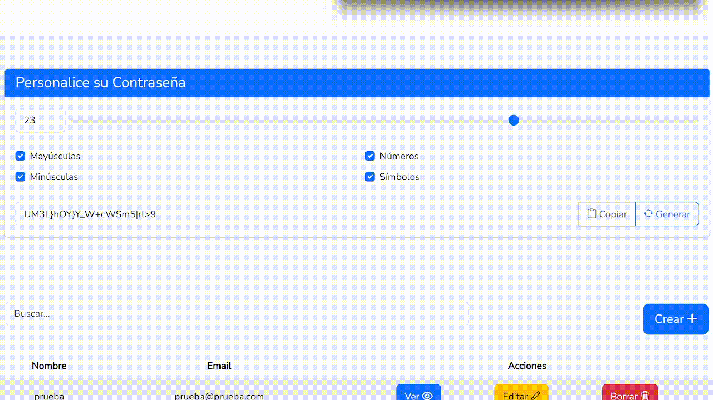

<p align="center"><a href="#" target="_blank"></a></p>

# PassWord

It is a project that allows you to have your passwords saved and organised in a very simple way. This project is a first version (2.0)

## Installation process

Clone the repository

    git clone https://github.com/pablopuch/manager_passwork.git

Install all the dependencies using composer

    composer install

Install all the dependencies using composer

    npm install

Copy the example env file and make the required configuration changes in the .env file

    cp .env.example .env

Generate a random key

    php artisan key:generate

Copy de Key_id and Client secrets with Google and GitHub. Config in dile .env

```php
GITHUB_CLIENT_ID=
GITHUB_CLIENT_SECRET=
GITHUB_REDIRECT=

GOOGLE_CLIENT_ID=
GOOGLE_CLIENT_SECRET=
GOOGLE_REDIRECT=
```

Run the database migrations (**Set the database connection in .env before migrating**)

    php artisan migrate

Start the local development server

    php artisan serve


## Screenshots





## Resources

Laravel Bootstrap - https://www.youtube.com/watch?v=9DU7WLZeam8&t=7587s

Laravel bootstrap UI - https://www.youtube.com/watch?v=9DU7WLZeam8&t=6865s

Laravel Socialite - https://www.youtube.com/watch?v=C98LvIbPSf0

Livewire Docs - https://livewire.laravel.com/


